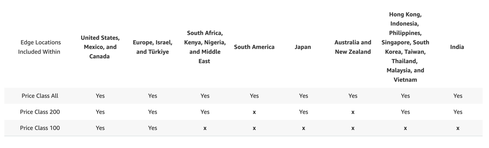

# Brief document on Amazon CloudFront service

- AWS CloudFront is CDN - content delivery network service which speeds up the
  delivery of the static or dynamic content delivered to the end user based on the
  nearest edge location.
- The content of the website will be cached in the nearest edge location whenever
  a user access your resources.
- As this data is cached, after a set period this data will expire based on the
  time interval we set.
- CloudFront uses distribution to control which source data it needs to redistribute
  and where.
- For additional security, when working with S3 you can create and associate a
  CloudFront user called an Origin Access Identity (OAI). Only an OAI can access
  and serve content from your bucket preventing anyone circumventing your CloudFront.
- It gives protection from DDoS attack and integration with AWS WAF, AWS Shield.
- Dynamic content, as determined at request time (cache-behavior configured to forward all headers) go directly to origin.
- Proxy methods PUT/POST/PATCH/OPTIONS/DELETE go directly to the origin
- CloudFront works from edge locations and doesn't belong to a VPC.

## CloudFront Origins:
- **S3 buckets**
  - For distributing files
  - Can provide enhanced security with **_Origin Access Control._**
  - OAC is now replaced with newer version called **_Origin Access Identity._**
  - Can be used as an ingress; to upload files to S3.
- **HTTP Endpoints such as:**
  - Ec2 Instance (Must be public, Allow public IP of Edge Locations in Security Group)
  - Application Load Balancer (Must be a public/external, Allow public IP of Edge Locations in Security Group, EC2 instances
    must allow ALB source in its security group and can be in private subnet)
  - Custom HTTP Endpoints
  - API Gateway.
    - For more control use API Gateway Edge.
- **S3 Website:**
  - This can be achieved by enabling static website hosting on S3 bucket.
- **MediaStore Container and MediaPackage Endpoint:**
  - To deliver Video On Demand or for Live-streaming video using AWS Media Services.

## CloudFront Geo Restriction:
- Can whitelist or blacklist users based on their origin country IP address.
- The country is determined by 3rd party Geo-IP database.
- **Use case:** Copyright laws to control access to content.
- Note:
: The geo header `CloudFront-Viewer-Country` is in Lambda@Edge.

## CloudFront vs S3 CRR:

### CloudFront:
  - Global Edge Network
  - Great for static content that must be available everywhere
  - TTL maybe for a day

### SR CRR:
  - Must be setup for each region you want replication to happen
  - Files are updated in near real time
  - Read only
  - Great for static/dynamic content that needs to be available at fewer region

### CloudFront Signed URLs:
- **Use case:** You want to share paid shared content to premium users around the world
- We can use CloudFront Signed URLs or Signed Cookies to access the private content with policies.
  - Includes URL expiration
  - Trusted Signers (Which AWS accounts can create Signed URLs)
  - Includes IP address range for which user can access the data
- Signed URL = Access to individual files
- Signed Cookies = Access to multiple files (One cookie for multiple files)

### CloudFront Price Classes:
- Price varies for per GB data transfer on network for different Edge Locations.
- There are three Price classes:
  - Price Class All: All regions, the best performance
  - Price Class 200: includes most region but excludes the most expensive region
  - Price Class 100: Only the least expensive region
- Below is the price class chart offering for reference.

### Web distribution:
  - Speed up distribution of static and dynamic content.
  -  Distribute media files using HTTP or HTTPS.
  - Add, delete or delete objects and submit data using web forms.
  - Use live-streaming to stream a live event.

### CloudFront Multiple Origins:
- To route to different kind of origins based on content type.
- We can route content to different origin based on path
  - /api/* - We can route the CloudFront request to ALB.
  - /* - We can route the request to S3 bucket.

### CloudFront Origin Groups:
- To increase high-availability and do failover.
- **Origin Group:** One primary and one secondary origin
- If primary origin fails, CloudFront can then failover to secondary origin.

### CloudFront Field Level Encryption:
- Protect user sensitive information through application stack.
- You can specify what fields to encrypt by specifying fields if POST request is made. (Upto 10 fields can be encrypted)
- Encryption of user sensitive data happens at Edge Location and is not accessible to any downstream layers.
- Only the origin can decrypt it using the private key.
- Uses asymmetric encryption.
- Adds extra layer of security.

### RTMP distribution:
  - Distribute streaming media with the Adobe Flash media service RTMP protocol.
  - The source data for your RTMP distribution can only exist in a S3 bucket and
    not an EC2 instance.

## CloudFront - Restrict Access to Application Load Balancers and Custom Origins
- Prevent direct access to your ALB or Custom Origins (only access through CloudFront)
- First, configure CloudFront to add a Custom HTTP Header to requests it sends to the ALB
- Second, configure the ALB to only forward requests that contain that Custom HTTP Header
- Keep the custom header name and value secret!

## CloudFront Signed URL vs 53 Pre-Signed URL:

### CloudFront Signed URL:

- Allow access to a path, no matter the origin
- Account wide key-pair, only the root can manage it
- Can filter by IP, path, date, expiration
- Can leverage caching features

### 53 Pre-Signed URL:
- Issue a request as the person who pre-signed the URL
- Uses the IAM key of the signing IAM principal
- Limited lifetime

## CloudFront - Customization at the Edge:
- Many modern applications execute some form of logic at the Edge.

### Edge Function:
- A code that you write and attach to CloudFront distributions.
- It runs closer to the users to minimize latency.
- Doesn't have any cache, only to send requests/responses.
- CloudFront provides two types: CloudFront Functions and [Lambda@Edge](../3-AWS-Serverless/AWS-Lambda.md#lamdaedge)

### Use cases:
- Manipulate HTTP requests and responses.
- Implement request filtering before reaching your application.
- User authentication and authorization.
- Generate HTTP responses at the Edge.
- A/B testing.
- BOT mitigation at the Edge.

Note:

: Lambda@Edge is going to be deployed at Regional Edge Cache level whereas CloudFront Functions are going to be deployed at
Edge Locations.