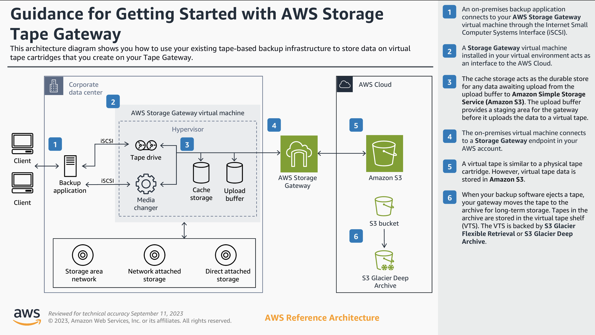
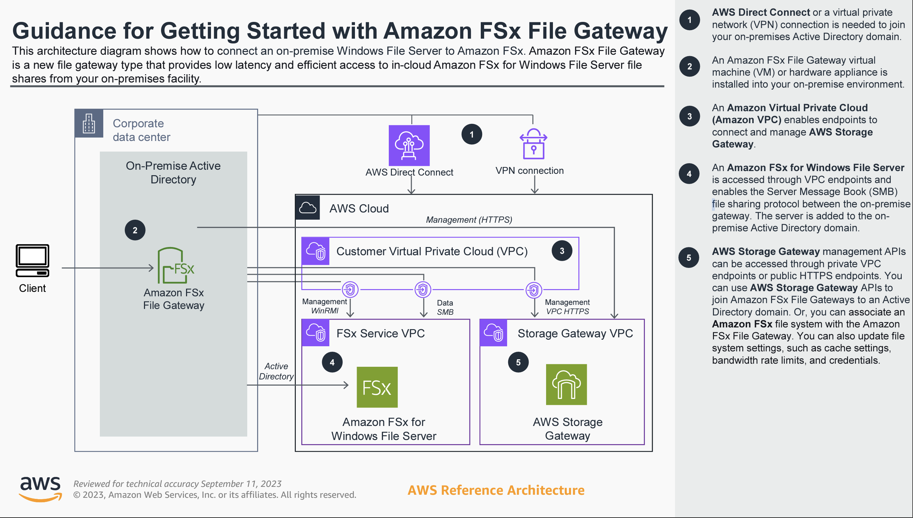

# Amazon Storage Gateway.

- Bridge between on-premise data and cloud data in S3.
- **Use cases:** disaster recovery, backup and restore and tiered storage.
- Provides the integration between On-Premise datacenter and AWS S3 or Glacier.
- On-premise cache and low latency file access.

**Three types:**

## File Gateway
- Pricing follows Amazon S3 pricing metrics.
- Configured S3 buckets are accessible using NFS and SMB protocol.
  - SMB protocol has integration with AD for user authentication.
- Bucket access using IAM roles for each file gateway.
- Provides a mount between on-premise files which will be stored in the S3 as objects. - # Is this really correct? Varies on what I learn on Udemy and CloudAcademy.
- Most recently used data is cached on the file-gateway.
- A cached data will be stored on the on-premise dc for providing low-latency.
- Actual data will reside on S3.

### File Gateway: S3 Object versioning:

- Ability to store multiple object versions.
- Helpful to restore a file to previous version.
-  Could restore an entire filesystem to a previous version.
- If the files are restored to a previous version, we must let the file-gateway appliance know.
  - There is a `RefreshCache` API on the gateway which is to be notified of the restore.

### File Gateway: S3 Object Lock:

- Enables to have the file gateway for Write Once Read Many (WORM) data.
- If there are file modifications or renames in the file share clients, the file gateway creates a new object without affecting the
  prior versions, hence the original objects remains unchanged. 

## Volume Gateway
- Again two kinds: Stored Volume Gateway or Cached Volume Gateway.
- Pricing follows the Amazon EBS volumes metrics.
- Provides the gateway to store the on-premise volumes as S3 as EBS snapshots.
- Volumes are backed by S3 as iSCSI devices.
- Pricing will differ for snapshots of the volumes.
- Backed by EBS snapshots which can help restore on-premises volumes.
- With cached volume gateway, primary data storage is on S3 rather on-premise.
- With Stored Volumes: Entire dataset is on-premise , scheduled backups on S3.
- Local volumes act as buffer and cache for low latency.

## Tape Gateway
- Also called as cloud based virtual tape library.
- Useful for creating backups of data which is infrequently accessed.
- Storage class will change depending on when data is last accessed.
- Can be moved to Amazon Glacier or Amazon Glacier Deep-Archive.
- Storage pricing is $0.024 per GB-month of data stored in S3.
- It is $0.0045 per GB-month of data stored in Glacier.
- It is $0.0018 per GB-month of data stored in Glacier-Deep Archive.

 
## Amazon FSx File Gateway:
- Native access to Amazon FSx for Windows FIle Server
- Local cache for frequently accessed data.
- Windows native compatibility (SMB, NTFS, Active Directory)
- Useful for group file shares and home directories

