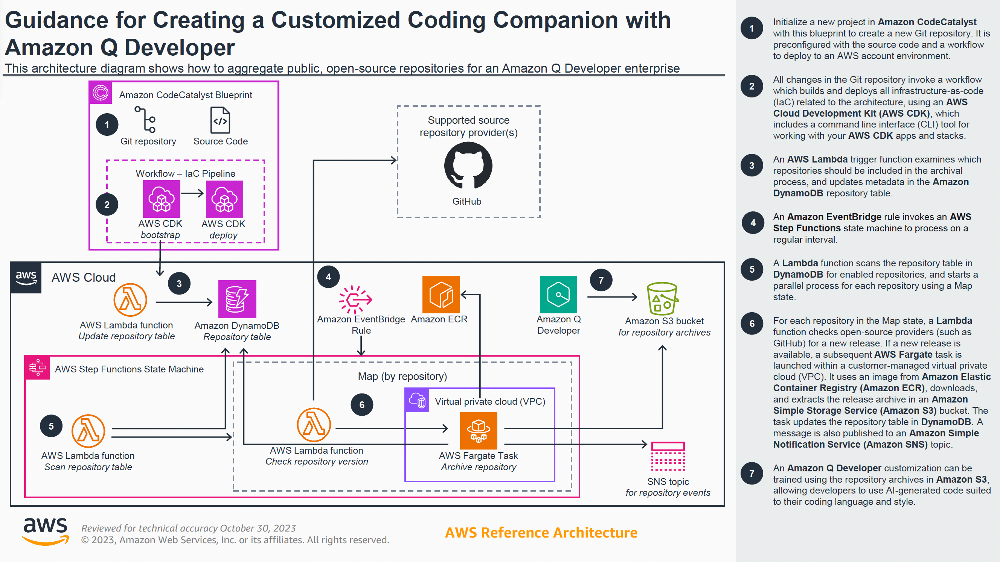

# AI-Practitioner/3-AmazonQ/AmazonQBusiness

## Introduction:
- Fully managed GenAI assistant for your employees.
- Based on your company's knowledge and data.
  - Answer questions, provide summaries, generate content, automate tasks.
  - Perform routine tasks.
- Built on Amazon Bedrock but we cant choose the underlying FM.

### Architecture:
- Data Connectors (Fully managed RAG) - connects to 40+ popular data sources.
- Built-in integration with following services:
  - Amazon S3, RDS, Aurora, WorkDocs, etc..
  - Microsoft 365, Salesforce, GDrive, Gmail, Slack, Sharepoint..
- Amazon Q will crawl these sources and perform tasks such as search and query them.
- Plugins—Allows you to interact with third-party services such as
  - Jira, ServiceNow, Zendesk, Salesforce

## Amazon Q Business - IAM Identity Center:

- Users can be authenticated through IAM identity center.
- Users receive responses generated only from the documents they have access to.
- Integrate IAM Identity Center with external Identity Providers.

## Admin Controls:
- Control and customize responses to your organization needs.
- Admin controls == Guardrails
  - Block specific words or topics.
- Respond only with internal information (vs external knowledge)
- Can setup Global controls and topic-level controls

Refer to following [AWS Blog on Amazon Q Business](https://aws.amazon.com/blogs/industries/unleashing-the-power-of-generative-ai-amazon-q-business-for-manufacturing-excellence/) for Generative AI.

## Amazon Q Apps (Q Business):
- Create GenAI powered apps without coding by using natural language.
- Create app based on company's internal data.

## Amazon Q Developer:
There are two use cases for Amazon Q Developer.

### Answer questions about AWS:

- Answer questions about the AWS documentation and AWS service selection.
- Answers questions about resources in your AWS account.
- Suggest CLI to run to make changes to your account.
- Helps you to do bills analysis, resolve errors and troubleshooting..

### AI Code Companion:
- AI code companion to help you code new applications (Similar to GitHub Copilot)
- Supports many languages.
- Ability to give real time code suggestions.
- Can perform security scan.
- Software agent to implement features, generate documentation for code, bootstrapping new projects.
- Integrates with IDE to help with your software development needs.
- Debugging, optimizations, improvements.

Following is the good use case referenced from AWS blog which gives us a guidance on how we can leverage Amazon Q Developer
for creating a customized coding companion.

## Amazon Q for AWS services:

### Amazon Q for QuickSight:

- Amazon QuickSight is used to visualize your data and create dashboard about them.
- Amazon Q understands natural language that you use to ask questions about your data.
- Create executive summaries of your data.
- Ask and answer questions of your data.
- Generate and edit visuals for your dashboards.

### Amazon Q for EC2:
- Provides guidance and suggestion for EC2 instance types that are best suited for your new workload.
- Can provide requirements using natural language to get even more suggestions or ask for advice by providing other workload requirements.

### Amazon Q for AWS chatbot:
- AWS Chatbot is a way for you to deploy an Chatbot application in a Slack or Microsoft Teams channel that knows about your AWS account.
  - can even execute AWS CLI commands on your behalf.
  - Hence, you need not leave chatbot application yet get access to AWS acocunts.
- Troubleshoot issues, receive notifications for alarms, security findings, billing alerts, create support request.
- You can access Amazon Q directly in AWS Chatbot to accelerate understanding of the AWS services, troubleshoot issues, and
  and identify remediation paths.

### Amazon Q for Glue:
- Answer questions about Glue.
- Generate code for AWS Glue ETL Scripts.
- Understand errors in AWS Glue jobs.
- Provide step-by-step instructions, to root cause and resolve your issues.