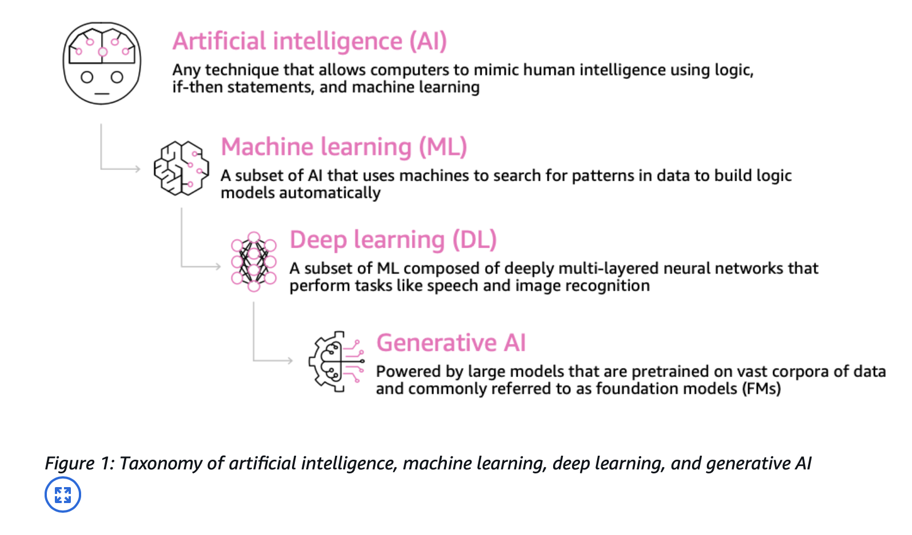

# AI-Practitioner/4-AI-ML

## AI:
- AI is a broad field for the development of intelligent systems capable of performing tasks that require human intelligence:
  - Perception
  - Reasoning
  - Learning
  - Problem Solving
  - Decision-making
- Umbrella-term for various techniques.

### AI Components:

- **Data Layers:** Collect vast amount of data.
- **ML Framework and Algorithm Layer:** Data Scientists and Engineer work together to understand use cases, requirements, and frameworks
    that can solve them.
- **Model Layer:** Implement a model and train it, we have the structure, the parameters and functions, optimizer function.
- **Application Layer:** How to serve the model and its capabilities for your users.

## Machine Learning:

- ML is a type of AI for building methods that allow machines to learn.
- Data is leveraged to improve computer performance on a set of task.
- Make predictions based on the data used to train the model.
- Following example [referenced from SimpliLearn](https://www.simplilearn.com/regression-vs-classification-in-machine-learning-article) shows a classic example of Machine Learning.
  - **Regression:** Able to determine the trend and prediction based on the dataset.
  - **Classification:** Able to classify between distinctive datasets.
- No explicit programming of rules is required. Algorithm will take care of finding patterns from the data provided.

## Deep Learning:
- Subset of ML, uses neurons and synapses to train a model.
- Process more complex patterns in the data then traditional ML.
- There is more than one layer of learning.
- Ex: Computer Vision: Image classification, object detection, image segmentation.
- Ex: Natural Language Processing: text classification, sentiment analysis, machine translation, language generation.
- Requires large amount of input data.
- Requires high GPU for parallel computations.

### Neural Networks:

The input data is put into network which is going to create connections between different layers in the network. And over time, new layers are going to be created, connections are going to change based on pattern in the data.

- As illustrated in the below diagram, nodes are connected together.
- Nodes are organized in layers.
- When the neural networks sees a lot of data, it identifies patterns and changes the connections between the nodes.
- Nodes are talking to each other, by passing on data to the next layer.
- Neural networks may have billions of nodes.

[Medium-article-reference-on-DeepLearning](https://medium.com/@mustaphaliaichi/neural-networks-and-deep-learning-a-comprehensive-introduction-092449336c1f)

## GenAI:

- Subset of Deep learning.
- Multi-purpose foundation model backed by neural networks.
- They can be fine-tuned if necessary to better fit our use-case.
- Leverages Transformers Model. (LLM)

### Transformer Models:
- Able to process a sentence as a whole instead of word by word.
- Faster and more efficient text processing.
- It gives relative importance to specific words in a sentence - more coherent sentences.
- Transformer based LLMs:
  - Powerful models that can understand and generate human-like text.
  - Chat generative Pretrained Transformer (ChatGPT).

### Multi-modal models:
- Multiple types of inputs and outputs.
- Input can be mix of text, audio and output can be mix of text and video.

Classification of AI as referenced from AWS:

### Good to know ML terminologies:

- **GPT (Generative Pre-trained Transformer):** generate human text or computer code based on input prompts.
- **BERT (Bidirectional Encoder Representations from Transformers):** similar intent to GPT, but reads the text in two directions, making it greate for translational purposes.
- **RNN (Recurrent Neural Networks):** meant for sequential data such as time-series or text, useful in speech recognition, time-series prediction.
- **ResNET (Residual Network):** Deep Convolutional Neural Network (CNN) used for image recognition, object detection, facial recognition.
- **SVM (Support Vector Machine):** ML algorithm for classification and regression.
- **WaveNET:** model to generate raw audio waveform, used in Speech Synthesis.
- **GAN (Generative Adversarial Network):** models used to generate synthetic data such as images, videos, or sounds that resemble the training data. Helpful for data augmentation.
- **XGBoost (Extreme Gradient Boosting):** an implementation of gradient boosting.
